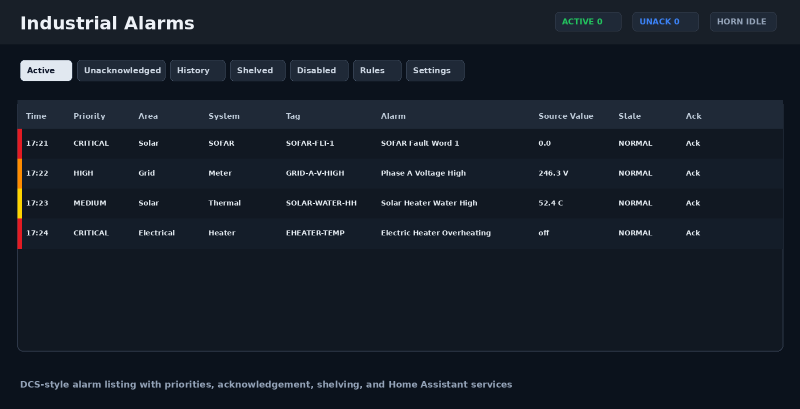

# Industrial Alarm Panel

[](https://www.hacs.xyz/)
[](https://github.com/AlRiachi/industrial-alarm-panel/releases)
[](https://www.home-assistant.io/)
[](LICENSE)

Industrial Alarm Panel is a Home Assistant custom integration that provides a DCS-style alarm annunciator for industrial, energy, and equipment monitoring.

It creates Home Assistant entities, exposes services and a websocket API, persists alarm rules and runtime state, stores alarm history in SQLite, and serves a dedicated sidebar panel at `/industrial-alarms`.

Current release: `v1.0.9`



## Highlights

- Dedicated Home Assistant sidebar panel at `/industrial-alarms`
- DCS-style alarm lifecycle: active, acknowledged, cleared, shelved, disabled
- Priority levels with horn behavior: `critical`, `high`, `medium`, `low`, `info`, `status`
- Per-rule binary sensors and operator action buttons
- Rule storage, runtime state persistence, and SQLite alarm history
- Browser horn and optional media-player sound output
- Suggested alarm rule generator for PowerTag/electrical/solar-water sensors
- Event-driven panel refresh with a polling fallback
- HACS-ready repository layout with local Home Assistant brand images

## What's New in v1.0.9

- Added resizable columns to the alarm, history, rules, and suggested-rule listings.
- Added a 2-second delay before new unacknowledged alarms receive full DCS row coloring, reducing transient visual noise.
- Throttled browser and media-player horn output so repeated Home Assistant refreshes or alarm floods do not stack noisy tones.
- Bumped the frontend cache-busting version and package metadata for the new release.

## What's New in v1.0.8

- Added **Suggested Rules** in the panel Rules tab.
- Suggested rules can create high-consumption, low-voltage, high-voltage, high solar-water temperature, and unavailable-sensor alarms.
- Added full-row DCS-style alarm colors, with acknowledged alarms shown in neutral gray.
- Added event-driven alarm refresh so new alarms appear faster than the polling fallback.
- Fixed Rules tab form inputs being cleared by automatic refresh while an operator is typing.
- Bumped the frontend cache-busting version to force Home Assistant browsers to load the new panel bundle.

## Installation

[](https://my.home-assistant.io/redirect/hacs_repository/?owner=AlRiachi&repository=industrial-alarm-panel&category=integration)

### HACS

1. Add this repository as a HACS custom repository with category `Integration`:

   ```text
   https://github.com/AlRiachi/industrial-alarm-panel
   ```

2. Install **Industrial Alarm Panel** from HACS.
3. Restart Home Assistant.
4. Go to **Settings > Devices & services > Add integration** and search for **Industrial Alarm Panel**.

After upgrading through HACS, restart Home Assistant again. If the sidebar panel was already open, hard refresh the browser with `Ctrl+Shift+R`.

The repository follows HACS integration layout rules: all runtime files are under `custom_components/industrial_alarm_panel`, with a root `hacs.json`, GitHub releases, and one integration directory under `custom_components`.

See [INSTALLATION.md](INSTALLATION.md) for manual installation, media-player sound setup, and a test rule.

## Brand Assets

This repository includes local Home Assistant brand assets in `custom_components/industrial_alarm_panel/brand/`:

- `icon.png` and `dark_icon.png`
- `logo.png` and `dark_logo.png`

Home Assistant 2026.3 and newer can serve local brand assets for custom integrations. Older Home Assistant versions still run the integration, but may not show the local icon/logo in all UI surfaces.

## Entities

Global entities include:

- `sensor.industrial_alarm_panel_active_count`
- `sensor.industrial_alarm_panel_unacknowledged_count`
- `sensor.industrial_alarm_panel_critical_count`
- `sensor.industrial_alarm_panel_high_count`
- `sensor.industrial_alarm_panel_last_alarm`
- `sensor.industrial_alarm_panel_last_event`
- `binary_sensor.industrial_alarm_panel_any_active`
- `binary_sensor.industrial_alarm_panel_any_unacknowledged`
- `binary_sensor.industrial_alarm_panel_horn_active`
- `switch.industrial_alarm_panel_sound_enabled`
- `button.industrial_alarm_panel_acknowledge_all`
- `button.industrial_alarm_panel_silence_horn`
- `button.industrial_alarm_panel_unsilence_horn`
- `button.industrial_alarm_panel_test_sound`
- `select.industrial_alarm_panel_filter_priority`
- `number.industrial_alarm_panel_history_retention_days`

Every stored rule also gets a binary alarm sensor and action buttons after the integration reloads.

## Rule Creation

Create and manage rules from **Developer Tools > Services**, automations, scripts, or the panel's rule editor.

Rules use stable Home Assistant `entity_id` values. For numeric range alarms, create two rules: one `below` rule and one `above` rule.

### Suggested Rules

Open **Industrial Alarms > Rules > Suggested Rules** and click **Create Suggested Rules** to scan current Home Assistant `sensor.*` entities and create common rules automatically.

Default suggested thresholds:

- `High W`: `2000 W` for power/high-consumption sensors
- `Low V`: `207 V`
- `High V`: `253 V`
- `Solar C`: `75 C` for solar water/tank/boiler temperature sensors

The generator detects candidates from `device_class`, unit of measurement, entity ID, and friendly name. It skips generated rule IDs that already exist so repeated clicks do not duplicate rules.

### Rule Fields

Common fields:

- `id`: stable rule ID. Keep it lowercase and unique.
- `entity_id`: source entity to monitor.
- `name`: operator-facing alarm name.
- `tag`: short DCS-style tag.
- `area`: room, plant area, or system area.
- `system`: equipment group, such as `SOFAR Inverter`, `Grid`, or `Electric Heater`.
- `condition`: one of `above`, `below`, `equal`, `not_equal`, `contains`, `is_on`, `is_off`, `state_changed`, `unavailable`, `unavailable_for`, `unknown_for`, `manual`.
- `threshold`: numeric value for `above` and `below`, or expected text for text conditions.
- `deadband`: hysteresis for numeric alarms.
- `priority`: `critical`, `high`, `medium`, `low`, `info`, or `status`.
- `instructions`: short operator guidance shown in the panel.

Optional fields include `requires_ack`, `audible`, `delay_on_seconds`, `delay_off_seconds`, `show_when_cleared`, and `shelving_allowed`.

### High Temperature Rule

Create a rule from Developer Tools > Services:

```yaml
service: industrial_alarm_panel.create_rule
data:
  rule:
    id: inverter_high_temp
    entity_id: sensor.inverter_temperature
    name: Inverter High Temperature
    tag: INV-TEMP-HH
    area: Solar Inverter
    system: PV
    condition: above
    threshold: 75
    deadband: 2
    priority: critical
    requires_ack: true
    audible: true
    delay_on_seconds: 5
    delay_off_seconds: 10
    instructions: Check inverter ventilation, fans, ambient temperature, and loading.
```

### Voltage Range Rules

```yaml
service: industrial_alarm_panel.create_rule
data:
  rule:
    id: grid_phase_a_voltage_low
    entity_id: sensor.shellyem3_e8db84d68e3c_channel_a_voltage
    name: Grid Phase A Voltage Low
    tag: GRID-A-V-LOW
    area: Electrical
    system: Grid Meter
    condition: below
    threshold: 207
    deadband: 3
    priority: high
    instructions: Check Phase A supply voltage and upstream breaker or utility condition.
```

```yaml
service: industrial_alarm_panel.create_rule
data:
  rule:
    id: grid_phase_a_voltage_high
    entity_id: sensor.shellyem3_e8db84d68e3c_channel_a_voltage
    name: Grid Phase A Voltage High
    tag: GRID-A-V-HIGH
    area: Electrical
    system: Grid Meter
    condition: above
    threshold: 253
    deadband: 3
    priority: high
    instructions: Check Phase A supply voltage and utility condition.
```

### Binary Problem Rule

```yaml
service: industrial_alarm_panel.create_rule
data:
  rule:
    id: electric_heater_overheating
    entity_id: binary_sensor.shellyplus1pm_c4d8d55505a0_switch_0_overheating
    name: Electric Heater Overheating
    tag: EHEATER-OVERTEMP
    area: Electrical
    system: Electric Heater
    condition: is_on
    priority: critical
    instructions: Turn off heater circuit if safe and inspect the load before re-enabling.
```

### Starter Alarm Ideas

Good first rules usually monitor:

- inverter native fault words, for example SOFAR fault registers `> 0`
- grid voltage low/high, for example `< 207 V` and `> 253 V` on 230 V nominal systems
- grid frequency low/high, for example `< 49.5 Hz` and `> 50.5 Hz`
- inverter heatsink or cabinet temperature high
- PV insulation resistance low
- solar heater water temperature high
- built-in problem binary sensors such as overheating, overcurrent, overpower, or overvoltage
- Home Assistant host power problem sensors
- internet connectivity loss if cloud/mobile notification delivery matters

## Services

The integration registers:

- `industrial_alarm_panel.acknowledge_alarm`
- `industrial_alarm_panel.acknowledge_all`
- `industrial_alarm_panel.silence_horn`
- `industrial_alarm_panel.unsilence_horn`
- `industrial_alarm_panel.shelve_alarm`
- `industrial_alarm_panel.unshelve_alarm`
- `industrial_alarm_panel.disable_alarm`
- `industrial_alarm_panel.enable_alarm`
- `industrial_alarm_panel.create_rule`
- `industrial_alarm_panel.update_rule`
- `industrial_alarm_panel.delete_rule`
- `industrial_alarm_panel.test_sound`
- `industrial_alarm_panel.export_history`

Silence only stops horn output. Acknowledgement changes the alarm lifecycle state.

## Sound

Browser sound is generated in the panel with Web Audio after the operator clicks **Enable Alarm Sound**. Media-player output uses Home Assistant `media_player.play_media` with files expected at:

```text
/config/www/industrial_alarm_panel/sounds/
```

Default filenames are `critical.mp3`, `high.mp3`, `medium.mp3`, `low.mp3`, and `info.mp3`.

## Storage

Rules are stored in Home Assistant storage with key `industrial_alarm_panel.rules`.
Runtime alarm states are stored with key `industrial_alarm_panel.state`.
History is stored in `/config/industrial_alarm_panel_history.db`.

## Troubleshooting

- If `/industrial-alarms` is blank after an update, restart Home Assistant and hard refresh the browser with `Ctrl+Shift+R`.
- If a newly created rule does not show as an entity yet, wait for the integration reload to finish or restart Home Assistant.
- If the horn does not play in the browser, click **Enable Alarm Sound** in the panel. Browsers block audio until a user gesture.
- If media-player sound does not play, confirm your MP3 files exist under `/config/www/industrial_alarm_panel/sounds/`.
- Check **Settings > System > Logs** for `industrial_alarm_panel` errors.

## Reporting Issues

Before opening an issue:

1. Update to the latest release.
2. Restart Home Assistant.
3. Reproduce the problem.
4. Check Home Assistant logs for `industrial_alarm_panel`.

Open a GitHub issue here:

```text
https://github.com/AlRiachi/industrial-alarm-panel/issues/new/choose
```

Please include:

- Home Assistant version
- Industrial Alarm Panel version
- install method, usually HACS custom repository
- browser and device if the issue is panel-related
- exact rule YAML or service data if the issue is rule-related
- relevant log lines and screenshots

Security issues should not be reported in public issues. See [SECURITY.md](SECURITY.md).

## Contributing

Pull requests are welcome. Keep changes focused, include tests for behavioral changes, and run:

```bash
python3 -m unittest discover -s tests -v
node --check custom_components/industrial_alarm_panel/frontend/dist/industrial-alarm-panel.js
```

See [CONTRIBUTING.md](CONTRIBUTING.md) for repository workflow and support expectations.

## Development

Runtime dependencies are provided by Home Assistant. The root `requirements.txt` documents that there are no extra runtime Python packages.

Run the pure core tests without Home Assistant installed:

```bash
python3 -m unittest discover -s tests -v
```

For full Home Assistant integration tests, install `requirements_test.txt` in a virtual environment and run pytest.
